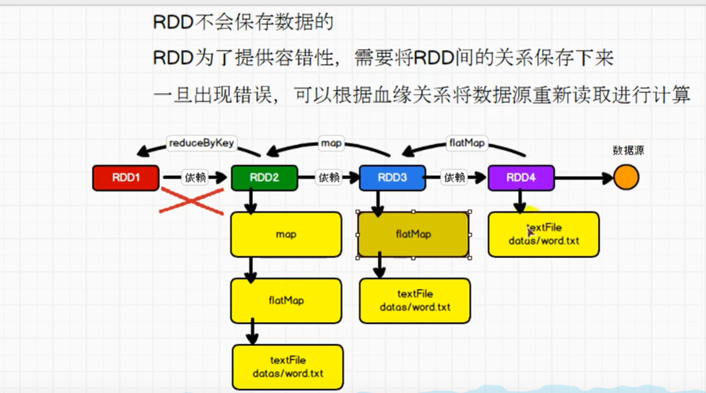

**# Spark**
_##章节介绍：_
### 1、spark框架简介
### 2、spark vs hadoop
### 3、快速上手
### 4、运行环境
        （在win10上运行会需要hadoop环境，需要在hadoop的bin目录下加上winutils.exe，且配置环境变量重启电脑）
### 5、核心组件
### 6、分布式计算（用网络编程I/O模仿）
### 7、RDD介绍
### 8、创建RDD
### 9、分区方式（）
### 10、并行度
### 11、内存rdd加载分区方式
### 12、读文件rdd分区方式

### 13、rdd算子
#### 13.1 transformation（转换）
            功能的补充和封装，就是将旧的RDD转换为新的RDD
           ` 注意（四个聚合算子的区别）
            reduceByKey,    :分区内和分区间的聚合一样
            aggregateByKey  :分区内和分区间的聚合可以不一样
            foldByKey       ：
            combineByKey`   ：
####    13.2 action（行动）
            触发任务执行her调度的苏算子

### 14、 序列化问题（Kryo序列化框架）

### 15、rdd依赖关系(容错) 
#### 15.1 Stage 

 
