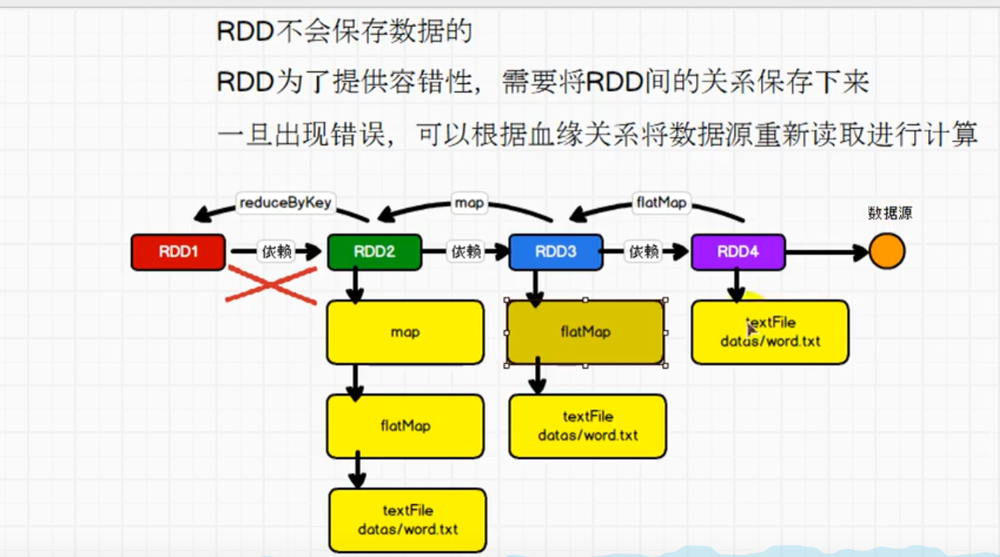
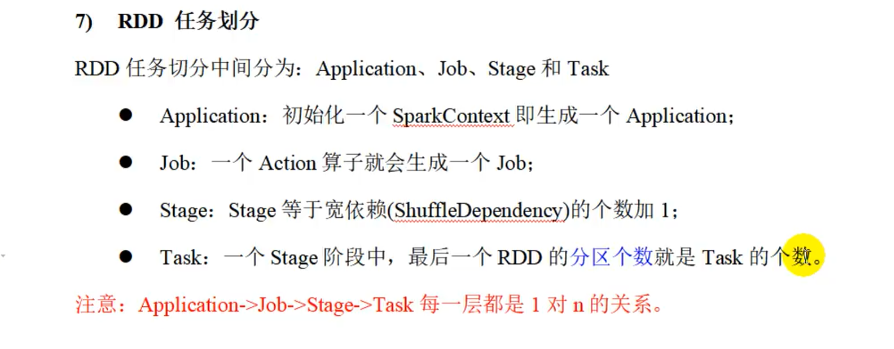
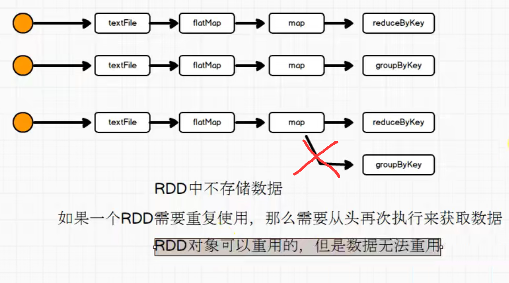
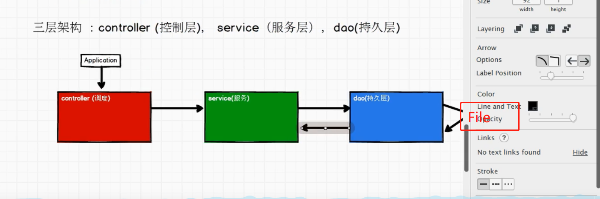

**# Spark**
_##章节介绍：_
### 1、spark框架简介
### 2、spark vs hadoop
### 3、快速上手
### 4、运行环境
        （在win10上运行会需要hadoop环境，需要在hadoop的bin目录下加上winutils.exe，且配置环境变量重启电脑）
### 5、核心组件
### 6、分布式计算（用网络编程I/O模仿）
### 7、RDD介绍
### 8、创建RDD
### 9、分区方式（）
### 10、并行度
### 11、内存rdd加载分区方式
### 12、读文件rdd分区方式
### 13、rdd算子
#### 13.1 transformation（转换）
            功能的补充和封装，就是将旧的RDD转换为新的RDD
           ` 注意（四个聚合算子的区别）
            reduceByKey,    :分区内和分区间的聚合一样
            aggregateByKey  :分区内和分区间的聚合可以不一样
            foldByKey       ：
            combineByKey`   ：
####    13.2 action（行动）
            触发任务执行her调度的苏算子

### 14、 序列化问题（Kryo序列化框架）

### 15、rdd依赖关系(容错) 
#### 15.1 Stage 
### 16、持久化 
### 17、工程代码的三成架构 
##### 主要项目目录层次 application => 应用服务
######                bean => 基础样例类
#####                common => 公共处理类（高复用性的类）
#####                controller => 控制层（控制流程的运行）      ***
#####                dao => 持久层（主要涉及文件与数据库的操作）   ***
#####                service => 服务层（主要涉及到数据的）       ***
#####                util => 工具类（小工具）
### 18、源码解析
#### 18.1、环境准备（yarn集群）
#####  1、Driver、Executor
#### 18.2、组件通信
#####  1、Driver=>Executor
#####  2、Driver=>Driver
#####  3、Executor=>Executor
#### 18.3、任务的划分
#####  1、RDD
#####  2、阶段的划分
#####  3、任务的切分
#####  4、任务的调度
#####  5、任务的执行
####18.4、shuffle
#####  1、shuffle的原理与执行过程
#####  2、shuffle写磁盘
#####  3、shuffle读磁盘
####18.5、内存的管理
#####  1、内存的分类
#####  2、内存的配置

    

 
